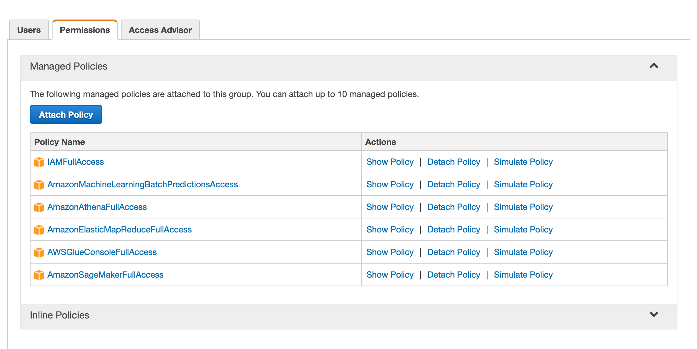

# Warm-up

Once you created your Amazon Web Services account you can put it to the test by storing files in on the cloud.

1. Follow the instructions at https://aws.amazon.com/getting-started/tutorials/backup-files-to-amazon-s3/
2. Once complete, follow this tutorial using the command line interface https://aws.amazon.com/getting-started/tutorials/backup-to-s3-cli/
3. Add the additional policies that are listed below to your user.

## Notes
1. Use 'us-east-1' as region (default)
2. Your Amazon S3 bucket must have a unique name, just like websites have unique names.
3. **Never ever** use blanks or special characters. The underscore and dash are allowed, though they shouldn't be mixed.

## References:
- Install AWS CLI tool https://docs.aws.amazon.com/cli/latest/userguide/install-cliv2.html 
  
